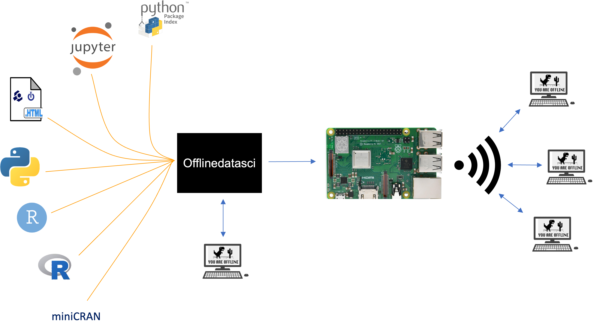

## Summary

Teaching, learning, and conducting data science often relies on internet
connections for accessing and distributing data, software, and
educational materials. As a result, it can be challenging to run data
science training and conduct data science work in locations with limited
or no internet access. We developed the offlinedatasci package to help
address this challenge as part of a broader set of tools and
instructional materials developed by Carpentries offline to facilitate
teaching and doing data science in internet limited environments.
Offlinedatasci automates the downloading and updating of the most recent
materials for running workshops, and conducting offline data science
work more broadly, including open source statistical and graphing
software (R and Python), the associated integrated development
environments (IDEs; RStudio and Jupyter), partial data science focused
mirrors of the associated package repositories (CRAN, PyPI), and lesson
materials structured for local use via the browser. This package
includes Python and command-line interfaces and is designed for both
maintaining local teaching servers (for instructors teaching in
internet-limited environments) and for local use by individual learners
and data science practitioners.

## Introduction and Statement of Need

Working with data has become more accessible with increased data
generation, more open data sharing practices, and improvements in
computational power and storage capacity [@kelleher2018ds]. In
response, there has been an increase in the development of software for
manipulating, visualizing, and analyzing data, as well as instructional
materials to make it easier to learn these important skills and tools.
The resulting data, software, and educational materials are typically
distributed online. As a result, these improvements in access to data
science tools and skills are not homogeneously distributed. The median
percent of population with Internet access across all countries is only
60.1% [cia2021internetusers]. This includes a connection from any device with
varying degrees of consistency ranging from continuously, to several
times a week, to once every few months. In the US, some of the factors
that are associated with limited internet access are race and ethnicity,
geography, and most importantly income [@swenson2021internet].
Low-income US households are less likely to have access to broadband and
more likely to have no internet access at all [@swenson2021internet]. Although the increase in internet access worldwide is undeniable,
the rate at which access increases and the quality of that access
remains unequal.

Most online data science tools and teaching materials make two basic
assumptions about the users' resources: 1) access to computers; and 2) a
stable internet connection to download data, install software, and view
teaching materials while learning or working. While access to a computer
is an unavoidable requirement for most stages of data science, the need
for regular internet access can be mitigated by obtaining the necessary
data, software, and lesson materials when and where internet access is
available. Once these materials are downloaded, much of the associated
training and data science work can be accomplished without internet
access. However, the knowledge necessary to accomplish this is often not
available to beginning data scientists. This makes limited internet
access particularly challenging in teaching environments, where students
often learn how to download and install data science tools during
classes and workshops. Workshops may be run without internet access and
many of the students may not have sufficient internet access prior to
the workshop, leading to problems in acquiring hundreds of megabytes
worth of software applications and their dependencies for workshop
attendees. Simplifying the downloading and offline use of data science
components that have internet requirements could ameliorate some of the
challenges that students and data scientists face due to unequal
accessibility to the internet.

The offlinedatasci package is part of a growing set of tools and
instructional materials developed by Carpentries offline to facilitate
teaching and doing data science in internet limited environments. The
larger ecosystem allows local computers, like Raspberry Pi's, to be used
as isolated servers to provide workshop attendees a wireless network to
acquire the necessary materials during workshops even when there is no
internet access. The offlinedatasci package automates the downloading
and updating of the most recent materials for running workshops and also
facilitates offline data science work more broadly by providing: 1) open
source statistical and graphing software (R and Python), 2) integrated
development environments (IDEs) for working with this software (RStudio
and Jupyter), 3) up-to-date mirrors of the package repositories used to
install data science packages (CRAN, PyPI), and 4) online lesson
materials configured for local viewing (currently a selection of
Carpentries workshop lessons with their respective practice data sets).

## Software Design (Methods)

This package is designed for two use cases. The original design focused
on instructors teaching data science in internet limited environments
using a Raspberry Pi, or other local computer capable of serving content
over WiFi, that students would connect to to access data, installers,
package repositories, and lesson material. This local server would serve
as a replacement for a connection to the world wide web. The
Offlinedatasci package was designed to make creating and updating the
content on this local teaching server easier. To make the software more
broadly useful it has been designed to be helpful to both individual
learners outside of a workshop and for individuals working in data
science who anticipate unreliable or no access to the internet. It
downloads a selection of software installers, configures partial mirrors
of package repositories, and downloads lessons content for later use on
the internet limited computer. This means that when an internet
connection is available a single command can be executed to download,
update, and configure all necessary material for later use.

### User knowledge assumptions

The package assumes that the user: 1) has an understanding of paths for
storing and accessing files; 2) is capable of either using a basic
command line interface (including flags) or running functions with
arguments from a Python package; and 3) knows how to use pip to install
Python packages.

### Core design and backend

The offlinedatasci package automatically downloads the most recent
versions of installers for essential tools including R, Python, and
Rstudio. Obtaining up-to-date software installers for all operating
systems students are likely to use requires automating the download of
the installer for the most recent version of the software for each
operating system. We accomplish this by parsing the html from the
relevant installer download pages, for R
(https://cran.r-project.org/),
Python
(https://www.python.org/downloads/),
and RStudio
(https://posit.co/download/rstudio-desktop/)
to determine the most recent versions and download the corresponding
installers for both Windows and macOS. In cases where multiple
installers are available for different architectures (e.g., M1/M2 macs
and Intel-based macs) we download all available installers to support
the widest range of possible user architectures (1.36 GB total as of
08/15/23). By leveraging Python\'s capabilities to parse web pages and
extract version information, we eliminate the need for manual checks for
updates and facilitate instructors, researchers, and data scientists
having the latest software readily available for future use. To avoid
unnecessary downloads in internet limited environments the update
mechanism checks if the most recent version of the required components
is already available locally (based on the names of the installers which
include the version number) and if the local version is up-to-date it is
not redownloaded. This approach avoids unnecessary data use while
ensuring that the latest version of the software is available.

Offlinedatasci also creates partial local mirrors of the R and Python
package repositories, containing data science packages for data
manipulation, visualization, and analysis. It also allows users to add
other packages to these mirrors. Installing packages is a common
activity in data science workshops and research. Creating local mirrors
of these package repositories can be complicated because 1) packages
typically depend on other packages and therefore require not only
downloading the package of interest but also its entire dependency tree;
and 2) package repositories must follow specific file structures with
appropriate metadata. To address this issue, we leverage software
packages designed to create partial mirrors of the CRAN and PyPI package
repositories. We use miniCRAN [@vries2022minicran] for mirroring CRAN and
pypi-mirror for mirroring PyPI. These packages automate the download of
packages including their full dependence trees and set up the local
repository file structures. These local mirrors can then be used by
pointing to a local teaching server with the repository mirror or by
individual users pointing to the mirrored repository on their own
machine. The later use case is facilitated by offlinedatasci commands
that can be used to automatically set R and Python to perform installs
from a specific local mirror. By default users can access a preselected
curated selection of packages and add more packages as needed without
worrying about dependency management and file structures. We focus on
partial mirrors containing the essential packages needed for data
science tasks, rather than full mirrors, to save time, bandwidth, and
storage since the full mirrors can be hundreds of gigabytes. Both
miniCRAN and pypi-mirror check versions and only download packages that
are either not present or for which a new release is available. This
allows package repository install and update commands to be run
regularly to ensure that the most up-to-date versions of packages are
always available.

Offlinedatasci also downloads lesson material to facilitate workshop
instruction and individual learning. The lesson materials currently
included are the Software Carpentry, Data Carpentry, and Library
Carpentry lessons. These open lesson materials serve as the foundation
for a global teaching effort, run by The Carpentries
(https://carpentries.org/),
that involves instruction in a number of regions with limited internet.
The software is also designed to allow the easy addition of any online
teaching material. Lesson material is written in a variety of different
formats and using a range of build systems that frequently rely on
external dependencies for rendering the lesson material into websites.
Therefore offlinedatasci downloads rendered content directly from lesson
websites to avoid the complexity and fragility associated with upstream
changes when building lessons from multiple sources. Our approach uses
Wget, a software package that enables retrieving files using common
internet protocols. We use Wget to manage this process, leveraging it\'s
capabilities to: 1) recursively mirror directories; automating the
process of finding all of the web pages associated with multiple page
lessons; 2) convert absolute links in downloaded documents to relative
links, allowing local links between pages to work in the local copies of
the lessons; 3) automate downloading all of the external resources
ensuring inclusion of things like images and CSS that are crucial for
the proper presentation of materials; 4) only download lesson pages that
have been updated since the last download; and 5) resume aborted
downloads, minimizing data use in cases of interruptions to internet
access. The lessons are presented on a single unified landing page, so
that users can open a single index.html file with their browser of
choice and smoothly navigate to all local lessons just as if they were
connected to the world wide web.

### Installation

The package can be installed via the Python Package Index (PyPI) using
pip:

`pip install offlinedatasci`

The development version can be installed directly from the associated
GitHub repository (https://github.com/carpentriesoffline/offlinedatasci/):

`pip install git+https://git@github.com/carpentriesoffline/offlinedatasci.git`

### User interface

The package has two interfaces, a command line interface and a Python
interface.

#### Command line interface

For workshop instructors, the standard approach to using offlinedatasci
will be to install all components for use on their local teaching
server. This is done using:

`offlinedatasci install all <path>`

where \<path> is replaced with the path where offlinedatasci should
create its storage directory.This will download software for both macOS
and Windows, set up repository mirrors for both Python and R packages,
and download and set up the default instructional material for viewing
from a local web browser.

More granular control for installing individual components is also
available to facilitate personal use and customizing content for
specific workshops. For example:

-   Install Python: `offlinedatasci install python <path>`

-   Install R and RStudio: `offlinedatasci install r rstudio <path>`

-   Install lessons: `offlinedatasci install lessons <path>`
 

-   Install R and Python package mirrors: `offlinedatasci install
    r-packages python-packages <path>`
  

-   Add additional R packages: `offlinedatasci add r-packages
    <packagename> <packagename> <path>`

-   Add additional Python packages:`offlinedatasci add python-packages
    <packagename> <packagename> <path>`

#### Python interface

The Python interface follows a similar structure but calling Python
functions directly rather than through the CLI. The default installation
command for workshop instructors that installs/updates all of the
software and lesson material is:

`import offlinedatasci as ods`

`ods.download_all("<path>")`

[The more granular functions follow a similar structure to those in the
CLI. For example:

-   Install Python: `ods.download_python("<path>")`

-   Install lesson material: `ods.download_lessons("<path>")`

-   Install R packages: `ods.download_r_packages("<path>")`

-   Instal custom R packages: `ods.download_r_packages("<path>", [<packagename>, <packagename>])`

## Acknowledgements

We would like to acknowledge The Carpentries for their support through regular interactions with their core staff, invaluable feedback their team members working in internet limited environments, and for infrastructure support including communications channels and incorporation into their incubator program.

# 

Figure 1. Visualization of offlinedatasci works in the context of the
larger Carpentries Offline system. Offlinedatasci handles downloading
and configuring software and lessons. This can be done on a local
teaching server, like a Raspberry Pi, that can then be used to serve
materials to learners taking classes or workshops. It can also be used
by individual learners or data science practitioners by installing it on
their personal computers.

References

